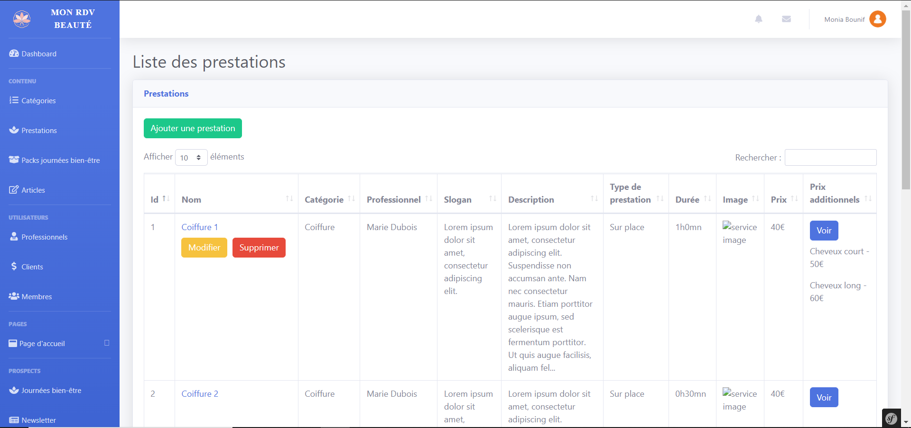

# Mon RDV Beauté

Mon RDV Beauté est une plateforme de réservation de services de beauté. L'utilisateur peut réserver un créneau pour un service, créer un compte et suivre ses RDV beauté, etc...

Le site a été développé avec Symfony pour le back-end, avec un système d'auth/authorization, un dashboard admin CRUD, une base de donnée MySQL et diverses bibliothèques permettant l'upload de fichiers (Vich Uploaders), la gestion des créneaux de RDV (tattali/calendar-bundle) etc...

## Getting Started for Projects

### Prerequisites

1. Check composer is installed
2. Check yarn & node are installed

### Install

1. Clone this project
2. Run `composer install`
3. Run `yarn install`
4. Create a `.env.local`. Take .env as a model.
5. Run `php bin/console doctrine:database:create`
6. Run `php bin/console doctrine:migration:migrate`

### Working

1. Run `php bin/console server:run` to launch your local php web server
2. Run `yarn run dev --watch` to launch your local server for assets

3. If you develop this site, you can run `bin/console doctrine:fixtures:load` to use fixtures.
4. Run `bin/console fos:js-routing:dump --format=json --target=public/js/fos_js_routes.json` to configure routes.

### Testing

1. Run `./bin/phpcs` to launch PHP code sniffer
2. Run `./bin/phpstan analyse src --level max` to launch PHPStan
3. Run `./bin/phpmd src text phpmd.xml` to launch PHP Mess Detector
3. Run `./bin/eslint assets/js` to launch ESLint JS linter
3. Run `./bin/sass-lint -c sass-linter.yml` to launch Sass-lint SASS/CSS linter

## Deployment

Add additional notes about how to deploy this on a live system

## Built With

* [Symfony](https://github.com/symfony/symfony)
* [GrumPHP](https://github.com/phpro/grumphp)
* [PHP_CodeSniffer](https://github.com/squizlabs/PHP_CodeSniffer)
* [PHPStan](https://github.com/phpstan/phpstan)
* [PHPMD](http://phpmd.org)
* [ESLint](https://eslint.org/)
* [Sass-Lint](https://github.com/sasstools/sass-lint)
* [Travis CI](https://github.com/marketplace/travis-ci)

## Contributing

Please read [CONTRIBUTING.md](https://gist.github.com/PurpleBooth/b24679402957c63ec426) for details on our code of conduct, and the process for submitting pull requests to us.

## Authors

- Béatrice BEAUPERIN
- Alexandre BARRÉ
- Benjamin DÉSIGNÉ
- Axel REDOIS
